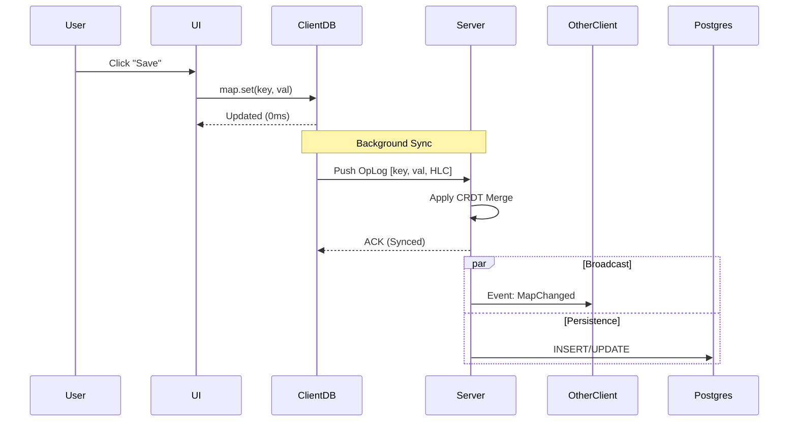
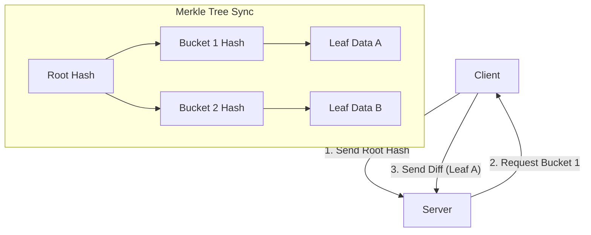

# TopGun v2 Whitepaper
## The Hybrid Offline-First In-Memory Data Grid

**Version:** 2.0
**Date:** November 2025
**Status:** Draft

---

## 1. Executive Summary

**TopGun** is a next-generation data platform designed for the modern "Local-First" web. It bridges the gap between scalable **In-Memory Data Grids (IMDG)** (like Hazelcast) and **Offline-First Client Databases** (like RxDB or PouchDB).

In traditional architectures, clients are "dumb" terminals that fetch data via REST/GraphQL. This creates latency, requires constant connectivity, and degrades user experience. TopGun inverts this model: **The Client is a Replica.**

TopGun provides:
-   **Zero-Latency UI:** Reads and writes happen locally against an in-memory CRDT.
-   **Offline Capability:** Data is persisted to IndexedDB (Browser) or SQLite (Mobile/Desktop).
-   **Real-Time Sync:** Automatic background synchronization using efficient Merkle Trees and WebSockets.
-   **Scalable Backend:** A server-authoritative cluster that partitions data and persists to standard databases like PostgreSQL.

TopGun is built for applications that need to work anywhere, anytime—without sacrificing consistency or scalability.

---

## 2. Key Concepts

### 2.1. Local-First Architecture
In a Local-First app, the primary data source is the **local database**. The network is treated as an optional enhancement.
-   **Traditional**: Client -> Network -> Server -> DB
-   **TopGun**: Client <-> Local DB <-> Network <-> Server

This ensures your app works perfectly in tunnels, elevators, or flaky 3G networks.

### 2.2. Optimistic UI & Consistency
TopGun uses **Optimistic Updates** by default. When a user performs an action, it is applied immediately to the local state. The UI updates in <16ms (one frame).
Behind the scenes, an **Operation Log (OpLog)** queues the mutation. The **Sync Engine** uploads it when the network is available.
Consistency is guaranteed via **Hybrid Logical Clocks (HLC)** and **CRDTs (Conflict-free Replicated Data Types)**, ensuring all clients eventually converge to the same state without manual conflict resolution code.

### 2.3. Sync vs Request
Instead of writing thousands of API endpoints (`GET /users`, `POST /todos`), TopGun synchronizes state.
-   **You don't fetch data**: You subscribe to a dataset (e.g., "All active todos").
-   **You don't send requests**: You mutate the local object (`map.set('status', 'done')`).
The **Sync Protocol** handles the transport, retries, and merging.

---

## 3. Architecture

TopGun consists of a **Client SDK** (running in browser/mobile) and a **Server Cluster** (running in cloud/on-prem).

### 3.1. High-Level Topology

```mermaid
graph TD
    subgraph "Client (Local-First)"
        UI[Application UI] <-->|Read/Write| LWW[LWW-Map (CRDT)]
        LWW <-->|Persist| IDB[(IndexedDB / SQLite)]
        IDB -->|Queue| Sync[Sync Engine]
    end

    subgraph "Server Cluster"
        Sync <-->|WebSocket| Gateway[Gateway Node]
        Gateway <-->|Route| Partition[Partition Engine (RAM)]
        Partition -->|Write-Behind| DB[(PostgreSQL / Mongo)]
        Partition -->|Broadcast| PubSub[Event Bus]
    end

    PubSub -.->|Push Updates| Sync
```

### 3.2. The Data Flow
1.  **Write**: User updates data.
2.  **Optimistic Apply**: Local CRDT updates, UI refreshes instantly.
3.  **Queue**: Operation added to persistent OpLog.
4.  **Sync**: Sync Engine pushes OpLog to Server.
5.  **Process**: Server coordinates via HLC, updates master state.
6.  **Broadcast**: Change pushed to other active clients.



---

## 4. Data Consistency

TopGun guarantees **Eventual Consistency** using robust distributed systems primitives.

### 4.1. Hybrid Logical Clocks (HLC)
Every event is tagged with an HLC timestamp. This combines physical time (wall clock) with a logical counter.
-   Allows ordering events across devices with drifting clocks.
-   "Last-Write-Wins" is determined by comparing HLCs, not unreliable `Date.now()`.

### 4.2. Merkle Tree Synchronization
To keep bandwidth low, TopGun doesn't re-download the whole dataset.
1.  Client and Server both maintain a **Merkle Tree** (hash tree) of their data.
2.  They exchange Root Hashes.
3.  If hashes differ, they traverse the tree to find exactly which "buckets" of data are different.
4.  Only the modified records are transmitted.



---

## 5. Comparison

| Feature | **TopGun** | **ElectricSQL** | **Firebase** | **RxDB** |
| :--- | :--- | :--- | :--- | :--- |
| **Primary Model** | Local-First IMDG | Postgres Sync | Cloud Doc DB | Local-First DB |
| **Offline Support** | First-Class | Good | Good | Excellent |
| **Latency** | ~0ms (In-Memory) | ~5-10ms (SQLite) | Network Dependent | ~5-10ms (IndexedDB) |
| **Backend Control** | Self-Hosted Cluster | Sync Service | Proprietary | CouchDB / Custom |
| **Consistency** | HLC + CRDT | Rich CRDTs | LWW (Server) | Revision Trees |
| **Distributed Locks** | Fencing Tokens | Not Supported | Not Supported | Not Supported |
| **License** | Open Source | Open Source | Proprietary | Open Source |

### Why TopGun?
-   **vs ElectricSQL**: TopGun operates entirely in-memory for zero-latency reads/writes, whereas ElectricSQL relies on SQLite access (5-10ms).
-   **vs Firebase**: TopGun gives you ownership of your data. Run it on your own cloud, use your own Postgres DB.
-   **vs RxDB**: TopGun includes a powerful, sharded server cluster for handling massive datasets and complex server-side logic, rather than just replication.

