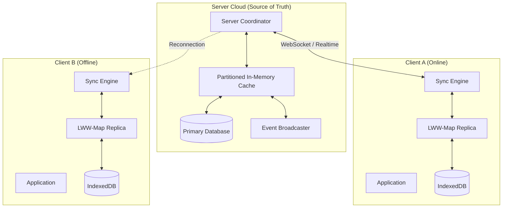

# 01. System Architecture

## 1. Architectural Vision
The system implements a **Hybrid Architecture** that combines the reliability of a central server with the resilience of offline-first clients.

- **Server-Authoritative**: The server is the single source of truth for the complete dataset and coordinates real-time interactions.
- **Client-Offline-Capable**: Clients maintain a local replica of their "working set", allowing full read/write functionality without a network connection.

## 2. High-Level Topology

## 3. Server-Side Components
The server acts as the coordination hub and the durable persistence layer.

### 3.1. Server Coordinator
- **Role**: Manages client connections, authentication, and protocol handling.
- **Functionality**:
  - Accepts WebSocket connections.
  - Validates HLC timestamps.
  - Routes operations to the Partition Engine.

### 3.2. Partition Engine (Backend)
- **Role**: Horizontally scalable in-memory storage.
- **Functionality**:
  - Distributes data across `271` partitions (server-side only).
  - Manages locks and transaction consistency for connected clients.
  - Flushes data to the underlying SQL/NoSQL database (Write-Behind/Write-Through).

### 3.3. Event Broadcaster
- **Role**: Real-time push notifications.
- **Functionality**:
  - Subscribes to partition changes.
  - Filters events based on client subscriptions (Queries/Predicates).
  - Pushes "Delta" updates to online clients immediately.

## 4. Client-Side Components (TypeScript)
The client is designed to be lightweight but autonomous.

### 4.1. IMap Proxy & LWW-Map
- **Role**: The primary API surface for the application.
- **Functionality**:
  - **Online**: Behaves like a local cache that syncs in the background.
  - **Offline**: Behaves like a local database.
  - Uses **Hybrid Logical Clock (HLC)** to tag all local mutations.

### 4.2. Operation Log (OpLog)
- **Role**: Records every mutation (`put`, `remove`) performed locally.
- **Structure**: Append-only log stored in IndexedDB.
- **Usage**:
  - Replayed to server upon reconnection.
  - Used to rollback/rebase if conflict resolution dictates.

### 4.3. Unified Storage Adapter
- **Role**: Abstraction over persistence.
- **Implementations**:
  - **Browser**: `IndexedDB` (via `idb` library).
  - **Node.js**: `SQLite` (via `better-sqlite3`) or `LevelDB`.
  - **React Native**: `AsyncStorage` or `sqlite`.

### 4.4. Sync Engine
- **Role**: Manages the data lifecycle.
- **States**:
  - `IDLE`: Monitoring changes.
  - `SYNCING_UP`: Uploading local OpLog to server.
  - `SYNCING_DOWN`: Downloading missed changes (Merkle Tree diff).
  - `REALTIME`: Listening for WebSocket events.

## 5. Data Flow Scenarios

### 5.1. Online Write (Optimistic)
1. App calls `map.put(key, val)`.
2. Client generates HLC Timestamp.
3. Client writes to **Local LWW-Map** and **OpLog** (IndexedDB).
4. **UI updates immediately**.
5. Sync Engine sends operation to Server via WebSocket.
6. Server applies operation (checks permissions, persists).
7. Server broadcasts change to other clients.
8. Server sends `ACK` to originating client -> OpLog entry marked "synced" (and eventually pruned).

### 5.2. Offline Write
1. App calls `map.put(key, val)`.
2. Client generates HLC Timestamp.
3. Client writes to **Local LWW-Map** and **OpLog**.
4. **UI updates immediately**.
5. Sync Engine detects "Offline" -> Pauses upload.

### 5.3. Reconnection & Sync
1. Connection established.
2. **Push Phase**: Client uploads unsynced OpLog entries.
3. **Pull Phase**:
   - Client sends Merkle Tree Root Hash of its dataset.
   - Server compares with its tree.
   - Server sends back only the differing keys (Delta).
4. **Conflict Resolution**:
   - Client merges incoming Deltas using LWW (Last-Write-Wins) based on HLC.
   - If Server Timestamp > Local Timestamp, local value is updated.
   - UI refreshes to reflect the converged state.

